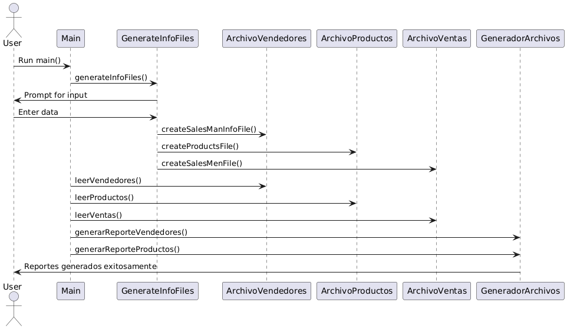

# CFDP-SG-15

This is the repository for the project related to Conceptos Fundamentales de Programación, subgrupo 15.

## Table of Contents
- Introduction
- How It Works
- Setup Instructions
- Project Creation
- Sequence Diagram
- Contributing
- License

## Introduction
This project is designed to manage sales information, generate reports for vendors and products, and process data from text files. It includes functionalities for reading and processing data, generating formatted reports, and handling sales calculations.

## How It Works
The project consists of several main components:
- **GenerateInfoFiles**: Reads input from the user to create sales and product files.
- **ArchivoVendedores**: Reads vendor information from a file.
- **ArchivoProductos**: Reads product information from a file.
- **ArchivoVentas**: Reads sales information from files and updates vendor and product data.
- **GeneradorArchivos**: Generates formatted reports for vendors and products.

### Workflow
1. **GenerateInfoFiles**: Collects data from the user and creates necessary files.
2. **ArchivoVendedores**: Reads vendor data from `data/vendedores.txt`.
3. **ArchivoProductos**: Reads product data from `data/productos.txt`.
4. **ArchivoVentas**: Reads sales data from files in `data/ventas` and updates vendor and product information.
5. **GeneradorArchivos**: Generates reports and saves them as CSV files.

## Setup Instructions
To set up and run the project, follow these steps:

1. **Clone the repository**:
    ```sh
    git clone https://github.com/yourusername/CFDP-SG-15.git
    cd CFDP-SG-15
    ```

2. **Compile the project**:
    ```sh
    javac -d bin src/main/java/main/java/entrega1/com/CFDP/proyecto/*.java
    ```

3. **Run the main class**:
    ```sh
    java -cp bin main.java.entrega1.com.CFDP.proyecto.main
    ```

4. **Follow the prompts** to enter vendor and product information.

## Project Creation
This project was created as part of the Conceptos Fundamentales de Programación course. It was developed using Java and follows object-oriented programming principles. The main goal is to handle sales data efficiently and generate useful reports.

## Sequence Diagram
Below is a sequence diagram illustrating the workflow of the project:

